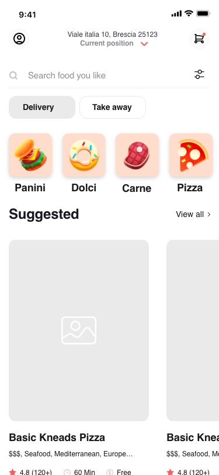
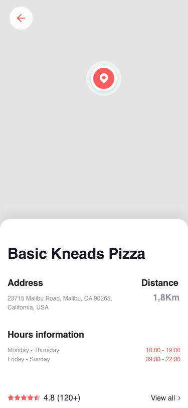
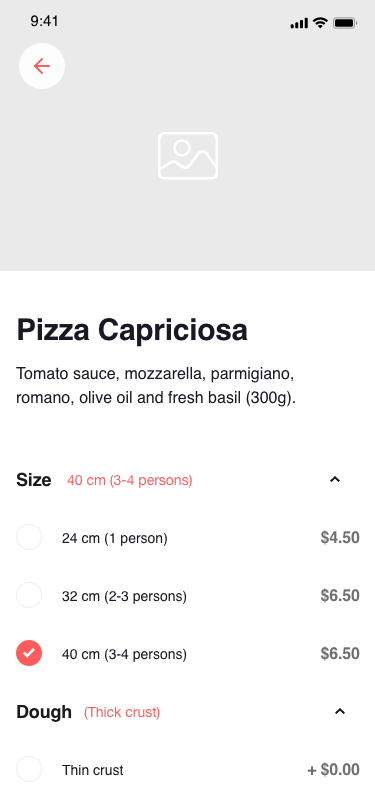
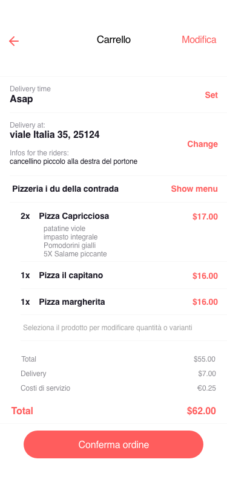
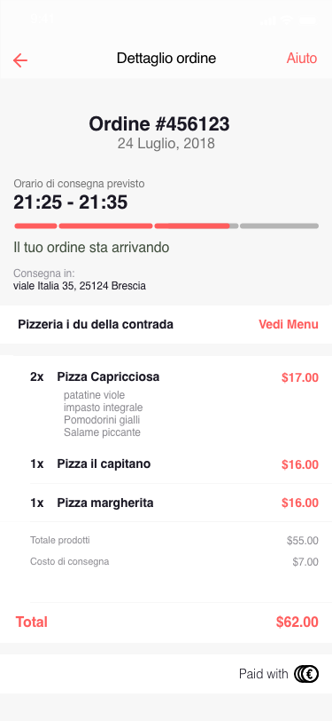

# deliveroo

This is food delivery app developed with react native.

 |  |  |  | 

## Features

- Stripe payment and cash features
- RESTFUL api
- Google map
- Food delivery tracking
- Push notification(FCM)
- Localization(English & Italian)
- Social authentication

## Author

Ilija Przeski